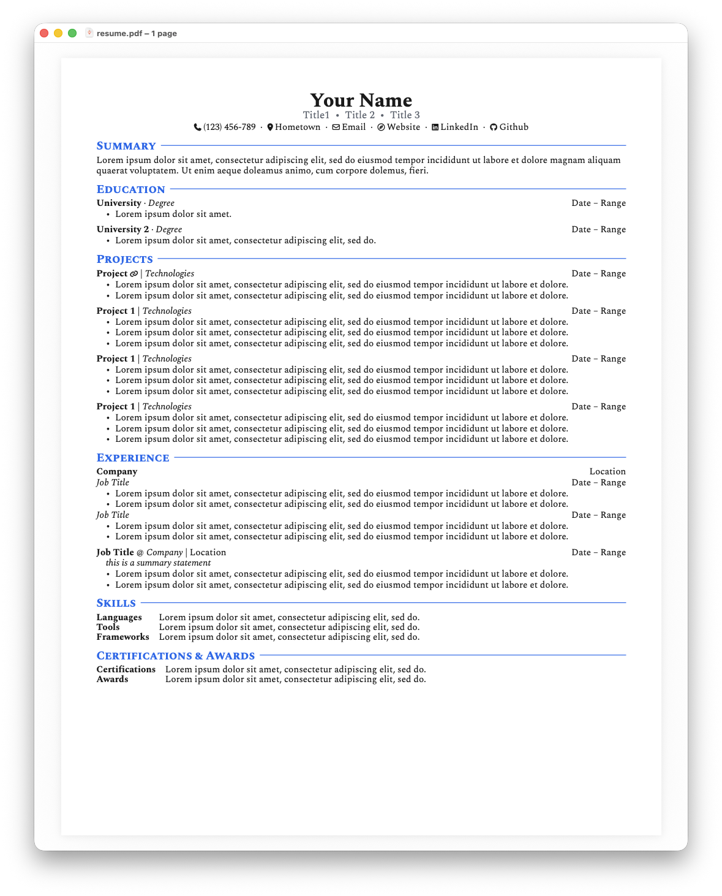

# 📄 Adam's Resume Template

A clean, component-based [Typst](https://typst.app) resume template with Font Awesome icons and a customizable accent color palette.




---

## Features

- **Single-file template** — everything lives in `resume.typ`
- **Configurable variables** — name, links, and colors declared once at the top
- **Reusable components** — `#section`, `#contact-link`, `#project-link`, `#muted-text`
- **Font Awesome icons** via [`@preview/fontawesome:0.6.0`](https://typst.app/universe/package/fontawesome)
- **US Letter** format with sensible 0.5in margins

---

## Getting Started

### Prerequisites

Install [Typst](https://github.com/typst/typst#installation), or use the [Typst web app](https://typst.app).

### Local

```sh
git clone https://github.com/adam-m-furman/personal-resume-template
cd personal-resume-template
typst compile resume.typ
```

### Typst web app

Upload `resume.typ` to a new project — it compiles automatically in the browser.
Ensure to include Font Awesome folder.

---

## Customization

Edit the variables at the top of `resume.typ`:

```typst
#let name       = "Your Name"
#let job-titles = ("Title 1", "Title 2", "Title 3")
#let phone      = "(123) 456-7890"
#let location   = "Your City"
#let email      = "you@example.com"
#let website    = "yoursite.com"
#let linkedin   = "your-handle"
#let github     = "your-username"

// Colors
#let accent = rgb("#2563eb")
#let body   = rgb("#1a1a1a")
#let muted  = rgb("#5D646F")
```

Document customization:

- Easily reorder sections
- Customize document paragraph and line spacing
- Customize content structure and add muted text compnents

---

## Template Structure

| Section | Description |
|---|---|
| **Header** | Name, job titles, and contact links with icons |
| **Summary** | Short professional bio |
| **Education** | Degree, institution, date range, bullets |
| **Projects** | Project links, tech stack, date range, bullets |
| **Experience** | Company, titles, locations, bullets |
| **Skills** | Two-column grid (category + list) |
| **Certifications & Awards** | Two-column grid |

---

## Helper Components

```typst
// Colored section heading with rule
#section("Experience")

// Contact link with Font Awesome icon
#contact-link(label, url, icon: "github")

// Bold project link with optional icon
#project-link("My Project", "https://github.com/...", icon: "link")

// Muted gray text
#muted-text("some secondary info")
```

---

## License

GPLv3 free sofware.